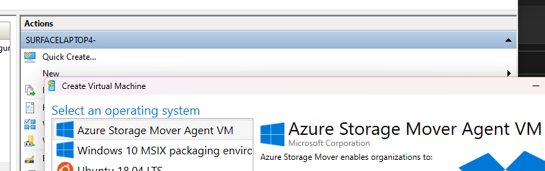

# azure-storage-mover-hyper-v-gallery
Hyper-V Gallery for Azure Storage Mover Agent

# Setup Hyper-V Gallery
The following commands must be executed on Administrator PowerShell.

## Add gallery
    New-ItemProperty -Path "HKLM:\SOFTWARE\Microsoft\Windows NT\CurrentVersion\Virtualization\"  `
        -Name 'GalleryLocations' -PropertyType MultiString -Value (
        'https://raw.githubusercontent.com/derdanu/azure-storage-mover-hyper-v-gallery/main/image.json',
        'https://go.microsoft.com/fwlink/?linkid=851584'
        )

## Remove gallery
    Remove-ItemProperty -Path "HKLM:\SOFTWARE\Microsoft\Windows NT\CurrentVersion\Virtualization\" -Name "GalleryLocations"

# Create a Azure Storage Mover Agent VM
1. Open Hyper-V Manager
2. Click on `Quick Create...`
3. Select `Azure Storage Mover Agent VM` and click on `Create Virtual Machine`
4. Click on `Connect` to connect to the VM
5. Login with `admin` and password `admin`

